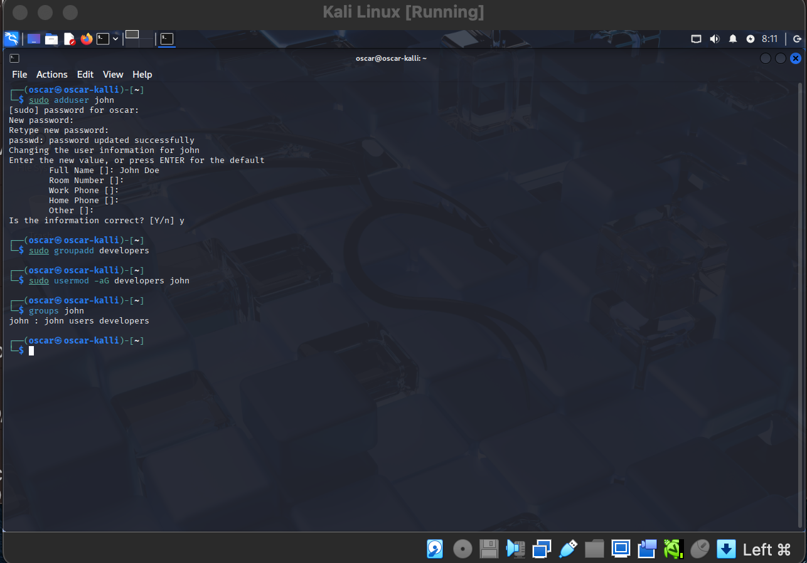
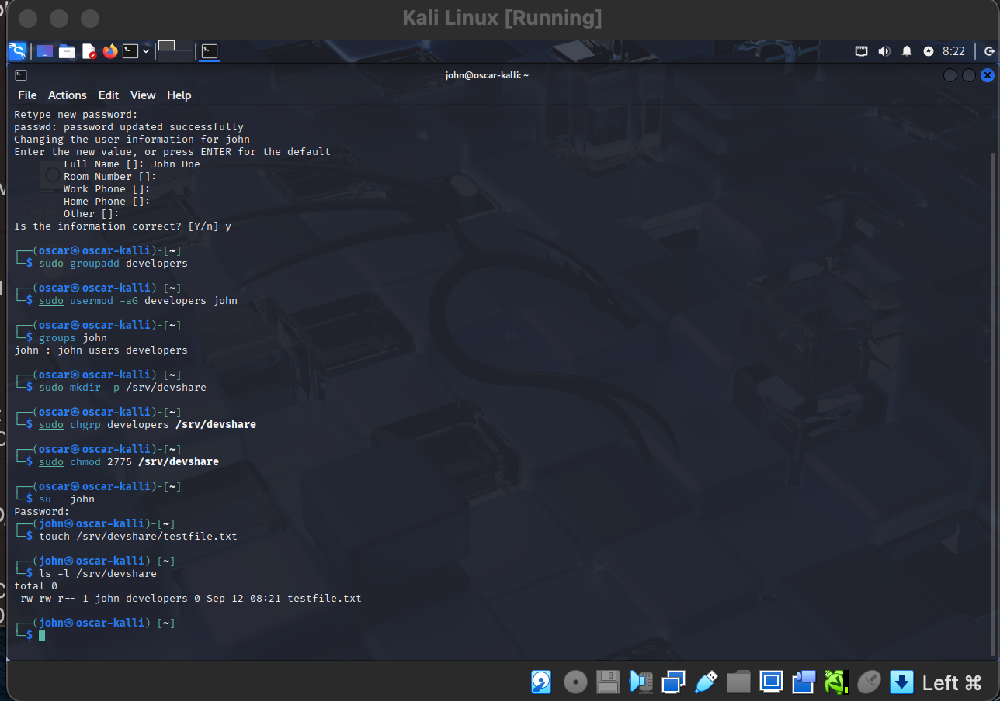
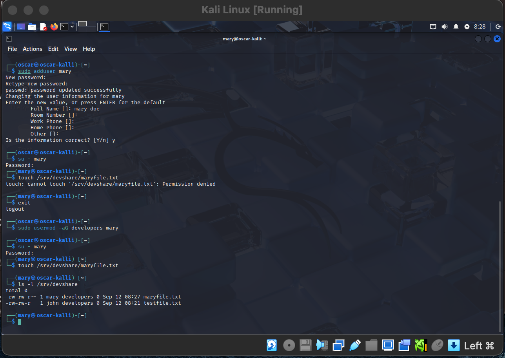

# Linux User & Permission Management Lab

## Overview
This lab demonstrates Linux system administration skills:
- Creating and managing users and groups
- Configuring and managing users and groups 
- Enforcing lease-privilege access

## key Commands used

- adduser, groupadd, usermod
- chrp, chmod
- su, ls, -l

## Screenshots

